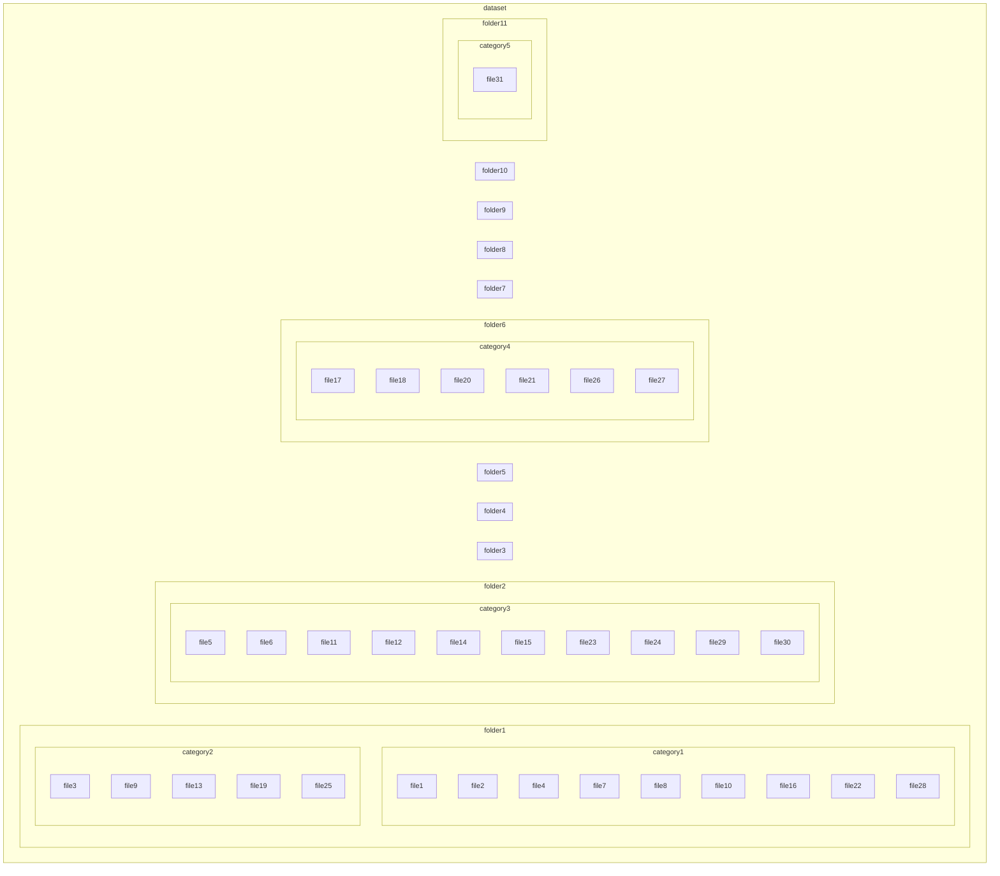

# 快捷指令数据集

欢迎来到快捷指令数据集项目！这是一个开源项目，旨在收集用户创建的苹果快捷指令（也称为 Siri 快捷指令）数据集，以分享有用的工作流程并启发他人。

## 介绍

苹果快捷指令是 iOS 和 macOS 上一个强大的自动化工具，允许用户创建自定义工作流程来自动化各种任务。该项目旨在收集、组织和分享来自世界各地用户的各种快捷指令。

## 快捷指令的来源

我们的快捷指令数据集来源于多个渠道，xx

## 我们的获取方法

1. 手动收集：我们团队成员手动收集有用的快捷指令分享网站。
2. 自动抓取：开发自动化工具从快捷指令分享网站上抓取快捷指令的 iCloud 链接。
3. 下载源文件：根据获取到的快捷指令 iCloud 链接下载快捷指令源文件。
4. 数据处理：

图片？？


## 我们提供的快捷指令数据

我们提供的快捷指令数据包括以下内容：

- 简短名称：每个快捷指令的简短名称，方便识别和查找。
- URL：快捷指令的下载链接，方便用户直接获取和安装。
- 商店描述：来自快捷指令应用商店的官方描述，介绍该快捷指令的功能和用途。
- 生成的描述：我们基于分析和用户反馈生成的描述，进一步阐述快捷指令的使用场景和操作步骤。
- 源文件：快捷指令的原始文件，供用户下载和查看。

```
{
    xx
}
```

## 快捷指令商店链接

我们提供的快捷指令来源于如下快捷指令商店：

- [Matthewcassinelli](https://matthewcassinelli.com/sirishortcuts/library/free)
- [Routinehub](https://routinehub.co)
- [MacStories](https://www.macstories.net/shortcuts)
- [ShareShortcuts](https://shareshortcuts.com)
- [ShortcutsGallery](https://shortcutsgallery.com)
- [iSpazio](https://shortcuts.ispazio.net)
- [捷径库](https://jiejingku.net)
- [少数派](https://shortcuts.sspai.com)
- [捷径范](https://jiejing.fun)
- [柯基捷径库](https://www.kejicut.com)
- [iOS快捷指令库](https://www.rcuts.com)



## 问题

欢迎大家使用并贡献更多有用的快捷指令！如有任何问题或建议，请随时联系我们。[xx]


中文版和英文版
