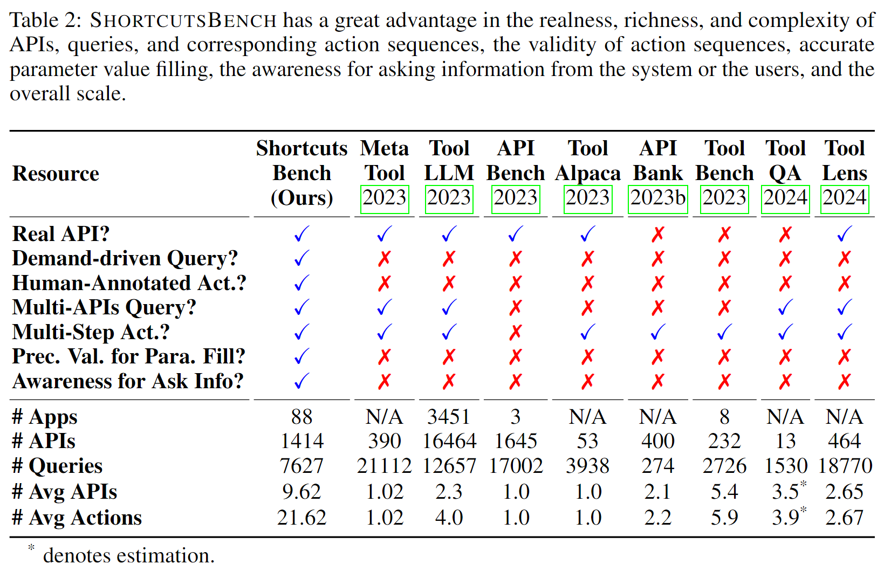

<div align= "center">
    <h1> 🔧ShortcutsBench📱</h1>
</div>

<div align="center">


</div>

<!-- <p align="center">
  <a href="#model">Model</a> •
  <a href="#data">Data Release</a> •
  <a href="#web-ui">Web Demo</a> •
  <a href="#tool-eval">Tool Eval</a> •
  <a href="https://arxiv.org/pdf/2307.16789.pdf">Paper</a> •
  <a href="#citation">Citation</a>

</p> -->

</div>

*Read this in [中文](README_ZH.md).*

**What are Shortcuts?**

Shortcuts are workflows built by developers in the Shortcuts app using a user-friendly graphical interface 🖼️ with the provided basic actions. [Apple](https://support.apple.com/en-us/guide/shortcuts/welcome/ios) describes them as "a quick way to get one or more tasks done with your apps." 📱

**Project Task List (Continuously Updated) 📋**

All data, data acquisition processes, data generated during cleaning, cleaning scripts, experiment scripts, results, and related files can be found in the following documents: [`deves_dataset/dataset_src/README.md` (English)](deves_dataset/dataset_src/README.md) or [Chinese](deves_dataset/dataset_src/README_ZH.md), [`deves_dataset/dataset_src_valid_apis/README.md` (English)](deves_dataset/dataset_src_valid_apis/README.md) or [Chinese](deves_dataset/dataset_src_valid_apis/README_ZH.md), and [`experiments/README.md` (English)](experiments/README.md) or [Chinese](experiments/README_ZH.md).

- [x] [ShortcutsBench Paper Main Text](https://arxiv.org/pdf/2407.00132)
- [ ] [ShortcutsBench Paper Appendix (Coming Soon)]()
- [x] Scripts for Data Acquisition, Data Cleaning and Processing, Experiment Code, and Experiment Results
- [ ] Explanation of Fields in Shortcut Files
- [ ] Explanation of Fields in API Information
- [x] We provide shortcuts with bilingual explanations for regular users: listed in `users_dataset/${website name}/${category name}/README.md` (English) or `users_dataset/${website name}/${category name}/README_ZH.md` (Chinese). Regular users can find suitable shortcuts for their work or life in our repository, which they can import into the Shortcuts app on Apple devices. Each shortcut includes:
    1. The iCloud link for the shortcut
    2. A description of the shortcut's functionality
    3. The source of the shortcut

* **For Shortcut Researchers**: `ShortcutsBench` provides: (1) Shortcuts (i.e., sequences of actions in `golden`); (2) Queries (i.e., tasks assigned to the agent); (3) APIs (i.e., tools available to the agent).
    - [x] Shortcuts
        - [x] Raw Shortcut Dataset, i.e., the file `1_final_detailed_records_remove_repeat.json`, can be downloaded as described in [`deves_dataset/dataset_src/README.md`](deves_dataset/dataset_src/README.md) (English) or [`deves_dataset/dataset_src/README_ZH.md`](deves_dataset/dataset_src/README_ZH.md) (Chinese), or directly from [Google Drive](https://drive.google.com/file/d/1oijSStXYGcmv6-THYVb6j0oCIfto_bVh/view?usp=sharing) or [Baidu Cloud](https://pan.baidu.com/s/1VJMDcWv3diRzecQisA80bQ?pwd=4wv1) (password: `shortcutsbench`).

            The APIs involved in the shortcuts in this file may not have corresponding API definition files.

        - [x] Filtered Shortcut Dataset, i.e., the file `1_final_detailed_records_filter_apis.json`, can be downloaded as described in [`deves_dataset/dataset_src/README.md`](deves_dataset/dataset_src/README.md) (English) or [`deves_dataset/dataset_src/README_ZH.md`](deves_dataset/dataset_src/README_ZH.md) (Chinese), or directly from [Google Drive](https://drive.google.com/file/d/12DJ7kWe8oRgVgdLyfr1VItETyCrpO-7O/view?usp=sharing) or [Baidu Cloud](https://pan.baidu.com/s/12cAPTPsdzE4DBSESXCOAoA?pwd=j0p8) (password: `shortcutsbench`).

            The APIs involved in the shortcuts in this file all have corresponding API definition files. This file is a cleaned version of `1_final_detailed_records_remove_repeat.json`. If a shortcut contains APIs without definition files, the shortcut is removed.

        - [x] Shortcuts Dataset `<=30`, i.e., the file `1_final_detailed_records_filter_apis_leq_30.json`, can be downloaded as described in [`experiments/README.md`](deves_dataset/dataset_src/README.md) (English) or [`experiments/README_ZH.md`](deves_dataset/dataset_src/README_ZH.md) (Chinese), or directly from [Google Drive](https://drive.google.com/file/d/1Xw8PI9FH_ud6_S5gR-xpneFDZsCoQHQM/view?usp=sharing) or [Baidu Cloud](https://pan.baidu.com/s/1NiKxy1KL9dNgIYq7aOZ8sA?pwd=sx6u) (password: `shortcutsbench`).

            Considering the context length limitation of language models, we only evaluated shortcuts with lengths `<=30` in the [ShortcutsBench paper](https://arxiv.org/pdf/2407.00132).

    - [x] Queries. The generated queries are shown in `generated_success_queries.json`, which can be obtained from [Google Drive](https://drive.google.com/file/d/1XzGYIUE0vXTiERJm2yVLZ90knb4uchQ2/view?usp=sharing) or [Baidu Cloud](https://pan.baidu.com/s/1RIRmJyc5y1hhnyMZBsAqUQ?pwd=y0er) (password: `shortcutsbench`).

        The queries are generated based on `1_final_detailed_records_filter_apis_leq_30.json`.

    - [x] APIs. The obtained APIs are shown in `4_api_json_filter.json`, which can be obtained from [Google Drive](https://drive.google.com/file/d/1ZFk6IybvUq8BY8uF06ckqMii-dVV5-lF/view?usp=sharing) or [Baidu Cloud](https://pan.baidu.com/s/1uEYXnTbFz7Nvaunvv8F6_w?pwd=zpft) (password: `shortcutsbench`).

        `4_api_json_filter.json` has been manually deduplicated, but a few duplicates remain. The raw unprocessed files extracted directly from the app are in `4_api_json.json`, which can be obtained from [Google Drive](https://drive.google.com/file/d/1clvUZ8MOcziy9rCg5ugj5V9O0kg7-iCK/view?usp=sharing) or [Baidu Cloud](https://pan.baidu.com/s/1uM3gJPBr_JRPw9SaZVzXSg?pwd=ghsl) (password: `shortcutsbench`).

## How can this project help you?

The [Apple Developer Conference WWDC'24](https://developer.apple.com/wwdc24/) introduced a lot of AI features on Apple devices 🤖. We are very interested in how Apple combines large language models like ChatGPT with devices to provide users with a smarter experience 💡. In this process, shortcuts will play a significant role! 🚀

### As a Shortcut User and Enthusiast 📱

You can find your favorite shortcuts in this dataset 📱 to help you complete various complex tasks with one click! For example:

* 🏡 **Daily Life** 🤹
  * [Holiday Reminders](https://www.icloud.com/shortcuts/5b3607d300e84e3d99889c7fb0258b92)
  * [Sign in to Baidu Tieba](https://www.icloud.com/shortcuts/084dc19b51904a8a98e9135159fd2a61)
  * ......

* 🛍️ **Shopping Enthusiasts** 🛒
  * [Buy PUBG Mobile UC](https://www.icloud.com/shortcuts/7234c2d743004377b4c74ea01d160648)
  * [Copy Taobao Password](https://www.icloud.com/shortcuts/e8dabf3b52eb412f9bdfeb6ce163cec3)
  * ......

* 🧑‍🎓 **Students** 🧮
  * [Calculator](https://www.icloud.com/shortcuts/477e692d2646448fb6364539b0fcb608)
  * [Relax Your Mind](https://www.icloud.com/shortcuts/5d1f7e70a3f24493be92be2ed427c070)
  * ......

* ⌨️ **Writers** 🔣
  * [Translator](https://www.icloud.com/shortcuts/62f3fd91e29749fda1576f80f62423ed)
  * [Create PDF](https://www.icloud.com/shortcuts/964373096afc424d90be716ea7a88c6e)
  * ......

* 🧑‍🔬 **Researchers** 🏫
  * [Get arXiv BibTeX Entry](https://www.icloud.com/shortcuts/2222c346272249ca96e06fb64ba53845)
  * ......

* .....

### As a Researcher 🔬
* Research on building automated workflows: Shortcuts are essentially workflows composed of a series of API calls (actions) provided by Apple and third-party apps 🔍.
* Research on low-code programming: Shortcuts include features like branches, loops, and variable assignments, while having a user-friendly graphical interface 🖥️.
* Research on API-based agents: Enabling large language models to autonomously decide whether, when, and how to use APIs based on user queries (tasks) 🔧.
* Research on fine-tuning large language models using shortcuts to closely integrate language models with phones, computers, and smartwatches, achieving the vision of an "operating system based on large language models" 📈.
* ......

## 🌟**Advantages of ShortcutsBench Over Existing API-Based Agent Datasets**🌟

SHORTCUTSBENCH has significant advantages in terms of the authenticity, richness, and complexity of APIs, the validity of queries and corresponding action sequences, the accurate filling of parameter values, the awareness of obtaining information from the system or users, and the overall scale.

To our knowledge, SHORTCUTSBENCH is the first large-scale agent benchmark based on real APIs, considering APIs, queries, and corresponding action sequences. SHORTCUTSBENCH provides a rich set of real APIs, queries of varying difficulty and task types, high-quality human-annotated action sequences (provided by shortcut developers), and queries from real user needs. Additionally, it offers precise parameter value filling, including raw data types, enumeration types, and using outputs from previous actions as parameter values, and evaluates the agent's awareness of requesting necessary information from the system or users. Moreover, the scale of APIs, queries, and corresponding action sequences in SHORTCUTSBENCH rivals or even surpasses benchmarks and datasets created by LLMs or modified from existing datasets. A comprehensive comparison between SHORTCUTSBENCH and existing benchmarks/datasets is shown in the table below.



**If you find this project helpful, please give us a Star ⭐️! Thank you for your support! 🙏**

**Keywords**: Shortcuts, Apple, WWDC'24, Siri, iOS, macOS, watchOS, Workflow, API Calls, Low-Code Programming, Agent, Large Language Model

## User Guide for Shortcuts (For Users) 📱

### Search for the Shortcut You Want 🔍

In this repository, the `users_dataset/${website name}/${category name}/README.md` file records the metadata of all shortcuts in the category, including name, description, iCloud download link, etc. Each `README.md` file follows this structure:

```markdown
### Name: Wine Shops # Shortcut Name
- URL: https://www.icloud.com/shortcuts/78ffd18288fd4da286bfd570993ea46e # iCloud Link
- Source: https://shortcutsgallery.com # Source
- Description: Look for Wine shops near you # Description
```

Use the shortcut `Ctrl + F` to search by keyword in the shortcut name directly in your browser 🔎. You can also visit [Shortcut Collection Sites](#data-sources-and-links-🌐) to search for the shortcuts you want 🌐.

### Import the Found Shortcut 📥

On your Apple device, click the iCloud link in the URL, and the shortcut will automatically open and be imported into your Shortcuts app 📲.

### Download Shortcut Source Files

Besides downloading shortcuts one by one using the iCloud links, you can directly get the complete data from the following links:

- [Baidu Cloud](https://pan.baidu.com/s/1qVX03DjSfBXXXW5W96jtqQ?pwd=33s2)
- [Google Drive](https://drive.google.com/drive/folders/171d_iiyBpQSfC-nLFpFDBq2P0Y7Tqw_m?usp=sharing)

#### Data Sources and Links 🌐

| Data Source | Metadata Location | Cloud Link |
| :---------: | :---------------: | :--------: |
| [Matthewcassinelli](https://matthewcassinelli.com/sirishortcuts/library/free) | [Location in this repository](users_dataset/matthewcassinelli.com_sirishortcuts_library_free) | [Google Drive Link](https://drive.google.com/drive/folders/1Dq9A44qP5s6-HOducpg-pGRbsyCGRNsW?usp=drive_link) \| [Baidu Cloud Link](https://pan.baidu.com/s/1Wru9TC_1MPqX26Ua6IzPQQ?pwd=3zwl) |
| [Routinehub](https://routinehub.co) | [Location in this repository](users_dataset/routinehub.co) | [Google Drive Link](https://drive.google.com/drive/folders/1IEhry0vnK48-GGF39kEMgQDtoSObR979?usp=drive_link) \| [Baidu Cloud Link](https://pan.baidu.com/s/1WFZw-G_w9QZQDyAdcYe-Yg?pwd=lp6d) |
| [MacStories](https://www.macstories.net/shortcuts) | [Location in this repository](users_dataset/www.macstories.net_shortcuts) | [Google Drive Link](https://drive.google.com/drive/folders/11z32E2_mphNcrcz0jg2RZ0Tit6zxxJOy?usp=drive_link) \| [Baidu Cloud Link](https://pan.baidu.com/s/1qfeCKUtTnO4gihSydfbYlg?pwd=u9p2) |
| [ShareShortcuts](https://shareshortcuts.com) | [Location in this repository](users_dataset/shareshortcuts.com) | [Google Drive Link](https://drive.google.com/drive/folders/197zOSqDcTlZp242NK38G1ShFs8Mi6qff?usp=drive_link) \| [Baidu Cloud Link](https://pan.baidu.com/s/13M6PSPXhSMwAhDuRLlqbIw?pwd=j7gn) |
| [ShortcutsGallery](https://shortcutsgallery.com) | [Location in this repository](users_dataset/shortcutsgallery.com) | [Google Drive Link](https://drive.google.com/drive/folders/1ieovTT-QOZIpub8BW8I7MicM9KcwJDwB?usp=drive_link) \| [Baidu Cloud Link](https://pan.baidu.com/s/1knXrn_OwPqUxaDvqSZQ1ag?pwd=ux9x) |
| [iSpazio](https://shortcuts.ispazio.net) | [Location in this repository](users_dataset/shortcuts.ispazio.net) | [Google Drive Link](https://drive.google.com/drive/folders/1lPmyxYE1UtKsOPNJU5b0zc6B7wyK-bns?usp=drive_link) \| [Baidu Cloud Link](https://pan.baidu.com/s/1l2IIrcpK7WTYuT3Ec57SxA?pwd=0l0u) |
| [Jiejingku](https://jiejingku.net) | [Location in this repository](users_dataset/jiejingku.net) | [Google Drive Link](https://pan.baidu.com/s/1WdgWmGkRfevTyit4i14DOg?pwd=ud3d) \| [Baidu Cloud Link](https://pan.baidu.com/s/1n0pxGttbsCttDZkVkOZiag?pwd=0yzg) |
| [SSPai](https://shortcuts.sspai.com) | [Location in this repository](users_dataset/shortcuts.sspai.com) | [Google Drive Link](https://pan.baidu.com/s/1BQcGi12fhtxOLD8gpt135A?pwd=tjqi) \| [Baidu Cloud Link](https://pan.baidu.com/s/1M2tR9lOFr-6rIeKoB7T8PQ?pwd=22fn) |
| [Jiejing.fun](https://jiejing.fun) | [Location in this repository](users_dataset/jiejing.fun) | [Google Drive Link](https://pan.baidu.com/s/1Hdco7WtgN0kEVfqcxJi3qQ?pwd=5732) \| [Baidu Cloud Link](https://pan.baidu.com/s/16oSRINZK-gyy38x51QO7dQ?pwd=2fj4) |
| [Kejicut](https://www.kejicut.com) | [Location in this repository](users_dataset/www.kejicut.com) | [Google Drive Link](https://pan.baidu.com/s/1SBlhUB3H6VPm5mwW0fHHyw?pwd=0q7p) \| [Baidu Cloud Link](https://pan.baidu.com/s/1kQwvwj5tQorJeYZ22w3iUw?pwd=8eah) |
| [RCuts](https://www.rcuts.com) | [Location in this repository](users_dataset/www.rcuts.com) | [Google Drive Link](https://pan.baidu.com/s/1UZLcXjmAVCLwZKiK4638Ug?pwd=8vv0) \| [Baidu Cloud Link](https://pan.baidu.com/s/1h8frW1928kfW38pnjJorGA?pwd=1c28) |

#### Introduction to Shortcut Source Files

The shortcut source data in the cloud drive is organized in the following directory structure:

```
users_dataset/
├── matthewcassinelli.com_sirishortcuts_library_free # Website Name
│   ├── file1
│   ├── file2
│   └── file3

or

users_dataset/
├── jiejingku.net # Website Name
│   ├── category1 # Category
│   │   ├── file1 # Each specific shortcut
│   │   └── file2
│   ├── category2
│   │   └── file3
```

Each file represents a shortcut. The file name is generated by simply processing the shortcut name, using the following code:

```python
file_name = re.sub(r'[^a-zA-Z0-9]', '_', name)
```

The shortcut source files we provide are in `JSON` format, whereas shortcuts exported from Apple devices are in the form of iCloud links (shared as links) or encrypted shortcut files with the `.shortcut` extension.

To import a shortcut source file into the Shortcuts app on `macOS`, follow these steps:
* Convert the `JSON` file format to `PLIST` format 📑:
    ```python
    import xml.etree.ElementTree as ET
    
    def parse_element(element):
      """
      Recursively parse XML elements and return dictionaries and lists.
      """
      if element.tag == 'dict':
          return {element[i].text: parse_element(element[i+1]) for i in range(0, len(element), 2)}
      elif element.tag == 'array':
          return [parse_element(child) for child in element]
      elif element.tag == 'true':
          return True
      elif element.tag == 'false':
          return False 
      elif element.tag == 'integer':
          return int(element.text)
      elif element.tag == 'string':
          return element.text
      elif element.tag == 'real':
          return float(element.text)
      else:
          raise ValueError("Unsupported tag: " + element.tag)
    
    tree = ET.parse(file_path)
    root_element = tree.getroot()
    parsed_data = parse_element(root_element[0])
    data = parsed_data

    save_path = "./"
    with open(save_path, 'w') as f:
        json.dump(data, f, indent=4)
    ```
* Sign the `PLIST` file 🔏 using `shortcuts sign --mode anyone --input $input_file --output $output_file`, replacing `$input_file` and `$output_file` with the actual file paths.
* Import the signed file into the Shortcuts app 📲.

## ShortcutsBench Dataset Construction Guide 📚


We detail the construction process of ShortcutsBench in the main text of our paper. For more details, please refer to our [paper](https://arxiv.org/pdf/2407.00132). Below are some additional details.

How to use shortcuts? How to share shortcuts? How to view the source files of shortcuts?

1. Import shortcuts into the Shortcuts app.

   You can import shortcuts into the Shortcuts app on Apple devices by clicking the iCloud link and using the shortcut as a regular user.

2. Share shortcuts.
   * You can share the shortcut as an iCloud link using the `Share` option in the Shortcuts app on `macOS` or `iOS`.
   * You can share the shortcut as a source file using the `Share` option in the Shortcuts app on `macOS`, resulting in a shortcut file with the `.shortcut` extension. Note: The shared source file is encrypted by Apple and cannot be directly parsed using the `plist` package in Python.

3. Decrypt single or multiple shortcuts.
   If you want to decrypt a specific shortcut, you can use the following shortcuts to decrypt other shortcuts. The decrypted files will be in `plist` format.
   * [Get Plist - Parse a single shortcut to a plist file](https://www.icloud.com/shortcuts/b04412850b9f4f74ad16f2f15ef09a3f)
   * [Get Plist Loop - Parse all shortcuts in the Shortcuts app to plist files and save them](https://www.icloud.com/shortcuts/b04412850b9f4f74ad16f2f15ef09a3f)

   To make it easier to read, you can choose to convert the `plist` files to `json` format. The shortcut source files we provide are all in `json` format.

4. How to acquire shortcut source files on a large scale?

   Instead of using `Get Plist` and `Get Plist Loop` to parse shortcuts, we follow these two steps for quicker and more efficient mass acquisition of shortcut source files:
   1. Obtain iCloud links in the format [https://www.icloud.com/shortcuts/${unique_id}](https://www.icloud.com/shortcuts/8fa07dea82cf413c81732dca5f15323f).
   2. Request partial metadata of the shortcut from [https://www.icloud.com/shortcuts/api/records/${unique_id}](https://www.icloud.com/shortcuts/89149640e212408694f69d031c7fa272), including the shortcut name and download link for the source file.
   3. Use the download link `cur_dict["fields"]["shortcut"]["value"]["downloadURL"]` obtained in the previous step to request the source file of the shortcut. Note: The download link expires quickly, so you need to use it promptly.

   The directly downloaded source file is in `plist` format. You can choose to convert the `plist` format to `json` format.

   The following code (simplified) demonstrates the entire process, with the final `response_json` being the `json` format shortcut source file:
   ```python
   response = requests.get(f"https://www.icloud.com/shortcuts/api/records/{unique_id}")

   cur_dict = response.json()
   downloadURL = cur_dict["fields"]["shortcut"]["value"]["downloadURL"]
   new_response = requests.get(downloadURL)
   # Convert using the plist package to json and store in response_json
   response_json = biplist.readPlistFromString(new_response.content)
   ```

## License Statement 📜

All code and datasets in this project are licensed under the `Apache License 2.0`. This means you are free to use, copy, modify, and distribute the content of this project, but must comply with the following conditions:

- **Copyright Notice**: The original copyright notice and license statement must be included in all copies of the project.
- **State Changes**: If you modify the code, you must indicate the changes in any modified files.
- **Trademark Use**: This license does not grant the right to use project trademarks, service marks, or trade names.

For the full text of the license, please see [LICENSE](./LICENSE).

Additionally, you must comply with the license agreements of the shortcut sharing sites that provided the data sources for this project.

# Citation

If you find this project helpful, please consider citing our work:

```latex
@misc{shen2024shortcutsbenchlargescalerealworldbenchmark,
      title={ShortcutsBench: A Large-Scale Real-world Benchmark for API-based Agents}, 
      author={Haiyang Shen and Yue Li and Desong Meng and Dongqi Cai and Sheng Qi and Li Zhang and Mengwei Xu and Yun Ma},
      year={2024},
      eprint={2407.00132},
      archivePrefix={arXiv},
      primaryClass={cs.SE},
      url={https://arxiv.org/abs/2407.00132}, 
}
```