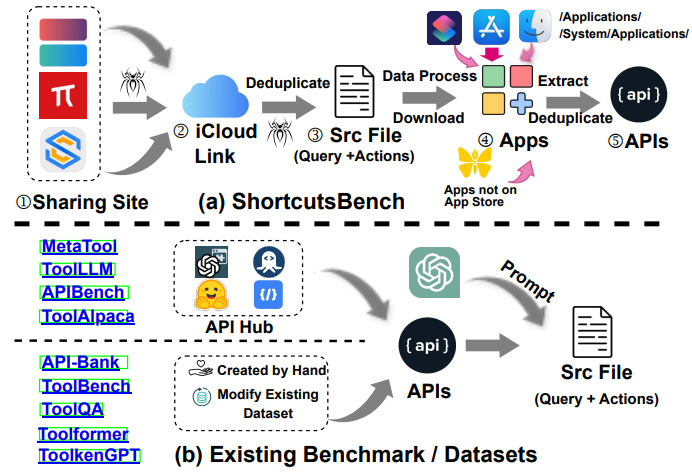

<div align= "center">
    <h1> 🔧ShortcutsBench📱</h1>
</div>

<div align="center">


</div>

<!-- <p align="center">
  <a href="#model">Model</a> •
  <a href="#data">Data Release</a> •
  <a href="#web-ui">Web Demo</a> •
  <a href="#tool-eval">Tool Eval</a> •
  <a href="https://arxiv.org/pdf/2307.16789.pdf">Paper</a> •
  <a href="#citation">Citation</a>

</p> -->

</div>

*Read this in [English](README.md).*

**快捷指令（Shortcuts）是什么？**

快捷指令是由开发者在快捷指令App中，通过用户友好的图形化界面🖼️，利用提供的基本动作构建的工作流🔄。[苹果官方](https://support.apple.com/zh-cn/guide/shortcuts/welcome/ios)称其为“一种可让你使用 App 完成一个或多个任务的快捷方式。”📱

**此项目任务清单（持续更新中）📋**

所有的数据、数据获取过程、清洗数据时产生的数据、清洗脚本、实验脚本、结果等所有文件，请参见[`deves_dataset/dataset_src/README.md`（英文）](deves_dataset/dataset_src/README.md)或[（中文）](deves_dataset/dataset_src/README_ZH.md)、[`deves_dataset/dataset_src_valid_apis/README.md`（英文）](deves_dataset/dataset_src_valid_apis/README.md)或[中文](deves_dataset/dataset_src_valid_apis/README_ZH.md)、和[`experiments/README.md`（英文）](experiments/README.md)或[中文](experiments/README_ZH.md)

- [x] [ShortcutsBench论文正文](https://arxiv.org/pdf/2407.00132)
- [x] [ShortcutsBench论文附录](https://arxiv.org/pdf/2407.00132)
- [x] 数据获取过程的脚本、数据清洗和处理的脚本、实验代码、实验结果
- [x] 我们为普通用户提供含有双语解释的快捷指令数据：即`users_dataset/${website name}/${category name}/README.md`（英文）或`users_dataset/${website name}/${category name}/README_ZH.md`（中文）中列出的快捷指令。一般快捷指令用户可以在我们的仓库中找到适合其工作或生活的快捷指令，导入苹果设备上的快捷指令App使用即可。每条快捷指令包括：
    1. 快捷指令的iCloud链接
    2. 快捷指令的功能描述
    3. 该快捷指令的来源

* **对于快捷指令的研究者**：`ShortcutsBench`提供：（1）快捷指令（即`golden`的动作序列）；（2）查询（即安排给智能体的任务）；（3）APIs（即智能体可以使用的工具）。
    - [x] 快捷指令
        - [x] 快捷指令数据集未清洗版，即文件`1_final_detailed_records_remove_repeat.json`，可以依据[`deves_dataset/dataset_src/README.md`](deves_dataset/dataset_src/README.md)（英文）或[`deves_dataset/dataset_src/README_ZH.md`](deves_dataset/dataset_src/README_ZH.md)（中文）的描述进行下载，也可以直接从[Google云盘](https://drive.google.com/file/d/1oijSStXYGcmv6-THYVb6j0oCIfto_bVh/view?usp=sharing)或[百度网盘](https://pan.baidu.com/s/1VJMDcWv3diRzecQisA80bQ?pwd=4wv1)获取，解压密码为`shortcutsbench`

            该文件中快捷指令涉及到的API不一定有相关的API定义文件

        - [x] 快捷指令数据集，即文件`1_final_detailed_records_filter_apis.json`，可以依据[`deves_dataset/dataset_src/README.md`](deves_dataset/dataset_src/README.md)（英文）或[`deves_dataset/dataset_src/README_ZH.md`]（中文）的描述进行下载，也可以直接从[Google云盘](https://drive.google.com/file/d/12DJ7kWe8oRgVgdLyfr1VItETyCrpO-7O/view?usp=sharing)或[百度网盘](https://pan.baidu.com/s/12cAPTPsdzE4DBSESXCOAoA?pwd=j0p8)获取，解压密码为`shortcutsbench`

            该文件中快捷指令涉及到的API均有相关的API定义文件。该文件为对`1_final_detailed_records_remove_repeat.json`清洗得到。如果一个快捷指令包含没有API定义文件的API，则该快捷指令被移除

        - [x] 快捷指令数据集`<=30`版，即文件`1_final_detailed_records_filter_apis_leq_30.json`，可以依据[`experiments/README.md`](deves_dataset/dataset_src/README.md)（英文）或[`experiments/README_ZH.md`]（中文）的描述进行下载，也可以直接从[Google云盘](https://drive.google.com/file/d/1Xw8PI9FH_ud6_S5gR-xpneFDZsCoQHQM/view?usp=sharing)或[百度网盘](https://pan.baidu.com/s/1NiKxy1KL9dNgIYq7aOZ8sA?pwd=sx6u)获取，解压密码为`shortcutsbench`

            考虑到语言模型上下文长度的限制，在[ShortcutsBench论文正文](https://arxiv.org/pdf/2407.00132)中，我们仅评测了长度`<=30`的快捷指令
    - [x] 查询。我们生成的查询如`generated_success_queries.json`所示，该文件可从[Google云盘](https://drive.google.com/file/d/1XzGYIUE0vXTiERJm2yVLZ90knb4uchQ2/view?usp=sharing)或[百度网盘](https://pan.baidu.com/s/1RIRmJyc5y1hhnyMZBsAqUQ?pwd=y0er)获取，解压密码为`shortcutsbench`

        查询是依据`1_final_detailed_records_filter_apis_leq_30.json`生成的

    - [x] APIs。我们获取到的API如`4_api_json_filter.json`所示，该文件可从[Google云盘](https://drive.google.com/file/d/1ZFk6IybvUq8BY8uF06ckqMii-dVV5-lF/view?usp=sharing)或[百度网盘](https://pan.baidu.com/s/1uEYXnTbFz7Nvaunvv8F6_w?pwd=zpft)获取，解压密码为`shortcutsbench`

        `4_api_json_filter.json`经过我们手动的去重，但依旧存在少量重复文件。直接从App中提取出的未经过处理的文件详见`4_api_json.json`，该文件可从[Google云盘](https://drive.google.com/file/d/1clvUZ8MOcziy9rCg5ugj5V9O0kg7-iCK/view?usp=sharing)或[百度网盘](https://pan.baidu.com/s/1uM3gJPBr_JRPw9SaZVzXSg?pwd=ghsl)获取，解压密码为`shortcutsbench`

## 该项目对您有什么帮助？

[苹果开发者大会 WWDC'24](https://developer.apple.com/wwdc24/)在苹果设备上引入了大量AI功能🤖。我们非常关注苹果如何将以ChatGPT为代表的大语言模型与设备结合，为用户带来更智能的体验💡。在这个过程中，快捷指令一定会发挥重要作用！🚀

### 作为快捷指令用户和爱好者📱

您可以在此数据集中找到您最心仪的快捷指令📱，一键帮你完成各种复杂任务！例如：

* 🏡 **日常生活** 🤹
  * [节日提醒](https://www.icloud.com/shortcuts/5b3607d300e84e3d99889c7fb0258b92)
  * [百度贴吧签到](https://www.icloud.com/shortcuts/084dc19b51904a8a98e9135159fd2a61)
  * ......

* 🛍️ **购物党** 🛒
  * [购买PUBG Mobile UC](https://www.icloud.com/shortcuts/7234c2d743004377b4c74ea01d160648)
  * [复制淘宝口令](https://www.icloud.com/shortcuts/e8dabf3b52eb412f9bdfeb6ce163cec3)
  * ......

* 🧑‍🎓 **学生党** 🧮
  * [计算器](https://www.icloud.com/shortcuts/477e692d2646448fb6364539b0fcb608)
  * [放空心灵](https://www.icloud.com/shortcuts/5d1f7e70a3f24493be92be2ed427c070)
  * ......

* ⌨️ **文字工作者** 🔣
  * [翻译器](https://www.icloud.com/shortcuts/62f3fd91e29749fda1576f80f62423ed)
  * [制作PDF](https://www.icloud.com/shortcuts/964373096afc424d90be716ea7a88c6e)
  * ......

* 🧑‍🔬 **科研工作者** 🏫
  * [获取 arXiv bibtex 条目](https://www.icloud.com/shortcuts/2222c346272249ca96e06fb64ba53845)
  * ......

* .....

### 作为研究者🔬
* 研究自动化工作流的构建：快捷指令本质上是由一系列API调用（动作）构成的工作流，这些API由苹果和第三方App提供🔍
* 研究低代码编程：快捷指令包含分支、循环、变量赋值等代码特征，同时拥有用户友好的图形化界面🖥️
* 研究基于API的智能体：让大语言模型根据用户查询（任务）自主决定是否、何时以及如何使用API🔧
* 研究利用快捷指令微调大语言模型，促进大语言模型与手机、电脑、智能手表的紧密结合，实现“基于大语言模型的操作系统”的愿景📈
* ......

## 🌟**ShortcutsBench对比现有基于API的智能体数据集的优势**🌟

ShortcutsBench 在 API 的真实性、丰富性和复杂性，查询和相应动作序列的有效性，参数值的准确填充，从系统或用户获取信息的意识，以及整体规模方面具有显著优势。

据我们所知，ShortcutsBench 是首个基于真实 API 的大规模智能体基准，考虑了 API、查询及相应的动作序列。ShortcutsBench 提供了丰富的真实 API、不同难度和任务类型的查询、高质量的人类注释动作序列（由快捷方式开发者提供），以及来自真实用户需求的查询。此外，它还提供了精确的参数值填充，包括原始数据类型、枚举类型以及使用之前动作的输出作为参数值，并评估智能体在请求系统或用户必要信息方面的意识。再者，ShortcutsBench 中 API、查询及相应动作序列的规模可与由 LLM 创建或现有数据集修改的基准和数据集相媲美甚至更优。ShortcutsBench 与现有基准/数据集的总体对比见下表。


**如果这个项目对您有帮助，请给我们一个Star吧⭐️！感谢支持！🙏**

**关键词**：快捷指令, 苹果, WWDC'24, Siri, iOS, macOS, watchOS, 工作流, API调用, 低代码编程, 智能体, 大语言模型

## 快捷指令使用指南（面向用户）📱

### 搜索您想要的快捷指令🔍

在本仓库中，`users_dataset/${website name}/${category name}/README.md`文件用于记录该类别的所有快捷指令的元信息，包括名称、描述、iCloud下载链接等。每一个`README.md`文件的结构如下：

```markdown
### Name: Wine Shops # 快捷指令名称
- URL: https://www.icloud.com/shortcuts/78ffd18288fd4da286bfd570993ea46e # 快捷指令iCloud链接
- Source: https://shortcutsgallery.com # 快捷指令来源商店
- Description: Look for Wine shop near by you # 快捷指令功能描述
```

使用快捷键`Ctrl + F`，根据快捷指令的名称关键词直接在浏览器中进行检索🔎。您也可以访问[快捷指令搜集站](#数据源与链接-🌐)搜索您想要的快捷指令🌐。

### 导入搜索到的快捷指令📥

在苹果设备上，点击URL中的iCloud链接后，快捷指令将会自动打开并导入到您的快捷指令App中📲。

### 下载快捷指令源文件

除了使用iCloud链接逐一下载快捷指令，您也直接从以下链接获取完整数据：

- [百度网盘](https://pan.baidu.com/s/1qVX03DjSfBXXXW5W96jtqQ?pwd=33s2)
- [Google云盘](https://drive.google.com/drive/folders/171d_iiyBpQSfC-nLFpFDBq2P0Y7Tqw_m?usp=sharing)

#### 数据源与链接 🌐

| 数据源 | 元数据位置 | 云盘链接 |
| :-------: | :----: | :----: |
| [Matthewcassinelli](https://matthewcassinelli.com/sirishortcuts/library/free) | [ 在本仓库的位置](users_dataset/matthewcassinelli.com_sirishortcuts_library_free) | [Google云盘链接](https://drive.google.com/drive/folders/1Dq9A44qP5s6-HOducpg-pGRbsyCGRNsW?usp=drive_link) \| [百度网盘链接](https://pan.baidu.com/s/1Wru9TC_1MPqX26Ua6IzPQQ?pwd=3zwl) |
| [Routinehub](https://routinehub.co) | [ 在本仓库的位置](users_dataset/routinehub.co) | [Google云盘链接](https://drive.google.com/drive/folders/1IEhry0vnK48-GGF39kEMgQDtoSObR979?usp=drive_link) \| [百度网盘链接](https://pan.baidu.com/s/1WFZw-G_w9QZQDyAdcYe-Yg?pwd=lp6d) |
| [MacStories](https://www.macstories.net/shortcuts) | [ 在本仓库的位置](users_dataset/www.macstories.net_shortcuts) | [Google云盘链接](https://drive.google.com/drive/folders/11z32E2_mphNcrcz0jg2RZ0Tit6zxxJOy?usp=drive_link) \| [百度网盘链接](https://pan.baidu.com/s/1qfeCKUtTnO4gihSydfbYlg?pwd=u9p2) |
| [ShareShortcuts](https://shareshortcuts.com) | [ 在本仓库的位置](users_dataset/shareshortcuts.com) | [Google云盘链接](https://drive.google.com/drive/folders/197zOSqDcTlZp242NK38G1ShFs8Mi6qff?usp=drive_link) \| [百度网盘链接](https://pan.baidu.com/s/13M6PSPXhSMwAhDuRLlqbIw?pwd=j7gn) |
| [ShortcutsGallery](https://shortcutsgallery.com) | [ 在本仓库的位置](users_dataset/shortcutsgallery.com) | [Google云盘链接](https://drive.google.com/drive/folders/1ieovTT-QOZIpub8BW8I7MicM9KcwJDwB?usp=drive_link) \| [百度网盘链接](https://pan.baidu.com/s/1knXrn_OwPqUxaDvqSZQ1ag?pwd=ux9x) |
| [iSpazio](https://shortcuts.ispazio.net) | [ 在本仓库的位置](users_dataset/shortcuts.ispazio.net) | [Google云盘链接](https://drive.google.com/drive/folders/1lPmyxYE1UtKsOPNJU5b0zc6B7wyK-bns?usp=drive_link) \| [百度网盘链接](https://pan.baidu.com/s/1l2IIrcpK7WTYuT3Ec57SxA?pwd=0l0u) |
| [捷径库](https://jiejingku.net) | [ 在本仓库的位置](users_dataset/jiejingku.net) | [Google云盘链接](https://pan.baidu.com/s/1WdgWmGkRfevTyit4i14DOg?pwd=ud3d) \| [百度网盘链接](https://pan.baidu.com/s/1n0pxGttbsCttDZkVkOZiag?pwd=0yzg) |
| [少数派](https://shortcuts.sspai.com) | [ 在本仓库的位置](users_dataset/shortcuts.sspai.com) | [Google云盘链接](https://pan.baidu.com/s/1BQcGi12fhtxOLD8gpt135A?pwd=tjqi) \| [百度网盘链接](https://pan.baidu.com/s/1M2tR9lOFr-6rIeKoB7T8PQ?pwd=22fn) |
| [捷径范](https://jiejing.fun) | [ 在本仓库的位置](users_dataset/jiejing.fun) | [Google云盘链接](https://pan.baidu.com/s/1Hdco7WtgN0kEVfqcxJi3qQ?pwd=5732) \| [百度网盘链接](https://pan.baidu.com/s/16oSRINZK-gyy38x51QO7dQ?pwd=2fj4) |
| [柯基捷径库](https://www.kejicut.com) | [ 在本仓库的位置](users_dataset/www.kejicut.com) | [Google云盘链接](https://pan.baidu.com/s/1SBlhUB3H6VPm5mwW0fHHyw?pwd=0q7p) \| [百度网盘链接](https://pan.baidu.com/s/1kQwvwj5tQorJeYZ22w3iUw?pwd=8eah) |
| [iOS快捷指令库](https://www.rcuts.com) | [ 在本仓库的位置](users_dataset/www.rcuts.com) | [Google云盘链接](https://pan.baidu.com/s/1UZLcXjmAVCLwZKiK4638Ug?pwd=8vv0) \| [百度网盘链接](https://pan.baidu.com/s/1h8frW1928kfW38pnjJorGA?pwd=1c28) |

#### 快捷指令源文件简介

网盘中的快捷指令源数据以以下目录结构组织：
```
users_dataset/
├── matthewcassinelli.com_sirishortcuts_library_free # 网站名称
│   ├── file1
│   ├── file2
│   └── file3

或

users_dataset/
├── jiejingku.net # 网站名称
│   ├── category1 # 类别 
│   │   ├── file1 # 每一个具体的快捷指令
│   │   └── file2
│   ├── category2
│   │   └── file3
```

每个文件代表一个快捷指令。文件名由快捷指令名称简单处理后生成，处理代码如下：
```python
file_name = re.sub(r'[^a-zA-Z0-9]', '_', name)
```

我们提供的快捷指令源文件为`JSON`格式，而从苹果设备中导出的快捷指令为`iCloud`链接（以链接形式分享）或是受到苹果加密的快捷指令文件（以`.shortcut`为后缀）。

若您希望将某个快捷指令源文件导入快捷指令App，请在`macOS`上进行以下操作：
* 将`JSON`文件格式转换为`PLIST`文件格式📑。
    ```python
    import xml.etree.ElementTree as ET
    
    def parse_element(element):
      """
      递归解析XML元素，返回字典和列表。
      """
      if element.tag == 'dict':
          return {element[i].text: parse_element(element[i+1]) for i in range(0, len(element), 2)}
      elif element.tag == 'array':
          return [parse_element(child) for child in element]
      elif element.tag == 'true':
          return True
      elif element.tag == 'false':
          return False 
      elif element.tag == 'integer':
          return int(element.text)
      elif element.tag == 'string':
          return element.text
      elif element.tag == 'real':
          return float(element.text)
      else:
          raise ValueError("Unsupported tag: " + element.tag)
    
    tree = ET.parse(file_path)
    root_element = tree.getroot()
    parsed_data = parse_element(root_element[0])
    data = parsed_data

    save_path = "./"
    with open(save_path, 'w') as f:
        json.dump(data, f, indent=4)
    ```
* 对该`PLIST`文件进行签名🔏，即`shortcuts sign --mode anyone --input $input_file --output $output_file`，`$input_file`和`$output_file`换成实际的文件路径。
* 将签名后的文件导入快捷指令App📲。

## ShortcutsBench数据集构建指南📚


我们在论文正文中详细阐述了ShortcutsBench的构建流程，详情请参见我们的[论文](https://arxiv.org/pdf/2407.00132)，以下补充一些细节。

如何使用快捷指令？如何分享快捷指令？如何查看快捷指令的源文件？

1. 导入快捷指令到快捷指令App。

   可以通过在苹果设备上点击iCloud链接将快捷指令导入快捷指令app从而作为普通用户使用该快捷指令。

2. 分享快捷指令。
   * 可以通过`macOS`或`iOS`上的快捷指令App的`Share`将该快捷指令转换成iCloud链接进行分享。
   * 可以通过`macOS`上的快捷指令App的`Share`将该快捷指令以源文件的形式分享，分享得到的快捷指令以`.shortcut`为文件名后缀。注意：分享的源文件为苹果加密过后的源文件，无法直接使用`python`的`plist`包解析。

3. 解密单个或多个快捷指令。
   如希望对某个快捷指令进行解密，可以使用如下快捷指令对别的快捷指令进行解密，解密后的文件为`plist`格式的文件。
   * [Get Plist，解析单个shortcut为plist格式的文件](https://www.icloud.com/shortcuts/b04412850b9f4f74ad16f2f15ef09a3f)
   * [Get Plist Loop，解析快捷指令App中的所有shortcut为plist格式的文件并保存](https://www.icloud.com/shortcuts/8fa07dea82cf413c81732dca5f15323f)

   为了方便阅读，您可以选择将该`plist`格式的文件转化为`json`格式的文件，我们提供的shortcut源文件均为`json`格式。

4. 如何大规模的获取快捷指令源头文件？

   相比使用`Get Plist`和`Get Plist Loop`从快捷指令中解析出快捷指令，为了更快捷高效的大量获取快捷指令的源文件，我们遵循了以下两个步骤：
   1. 获取形如`https://www.icloud.com/shortcuts/${unique_id}`。
   2. 从`https://www.icloud.com/shortcuts/api/records/${unique_id}`。
   3. 从上一步骤中获得的数据`cur_dict`中（可转化为`json`格式），拿到快捷指令源文件的下载链接`cur_dict["fields"]["shortcut"]["value"]["downloadURL"]`，再次请求该下载链接下载快捷指令的源文件。注意：该下载链接会很快过期，您需要尽快使用该链接。

   直接下载得到的源文件为`plist`文件格式，你可以选择将`plist`格式的文件专户为`json`格式的文件。

   以下代码（已简化）展示了上述所有过程，最终的`response_json`即为`json`格式的快捷指令源文件:
   ```python
   response = requests.get(f"https://www.icloud.com/shortcuts/api/records/{unique_id}")

   cur_dict = response.json()
   downloadURL = cur_dict["fields"]["shortcut"]["value"]["downloadURL"]
   new_response = requests.get(downloadURL)
   # 使用plist包转换为json存储在response_json中
   response_json = biplist.readPlistFromString(new_response.content)
   ```

## 许可声明 📜

本项目中的所有代码和数据集均依据`Apache License 2.0`进行许可。这意味着您可以自由地使用、复制、修改和分发本项目的内容，但需遵守以下条件：

- **版权声明**：必须在项目的所有副本中保留原始版权声明和许可证声明。
- **状态声明**：如果对代码进行了修改，必须在任何修改文件中标明所做的更改。
- **商标使用**：本许可不授予使用项目商标、服务标志或商品名称的权利。

完整的许可证文本请见[LICENSE](./LICENSE)。

此外，您还需遵守本项目数据来源，各个快捷指令分享站的许可协议。

# 引用

如果您觉得有用，请考虑引用我们的工作：
```latex
@misc{
    shen2024shortcutsbenchlargescalerealworldbenchmark,
    title={ShortcutsBench: A Large-Scale Real-world Benchmark for API-based Agents}, 
    author={Haiyang Shen and Yue Li and Desong Meng and Dongqi Cai and Sheng Qi and Li Zhang and Mengwei Xu and Yun Ma},
    year={2024},
    eprint={2407.00132},
    archivePrefix={arXiv},
    primaryClass={cs.SE},
    url={https://arxiv.org/abs/2407.00132}, 
}
```