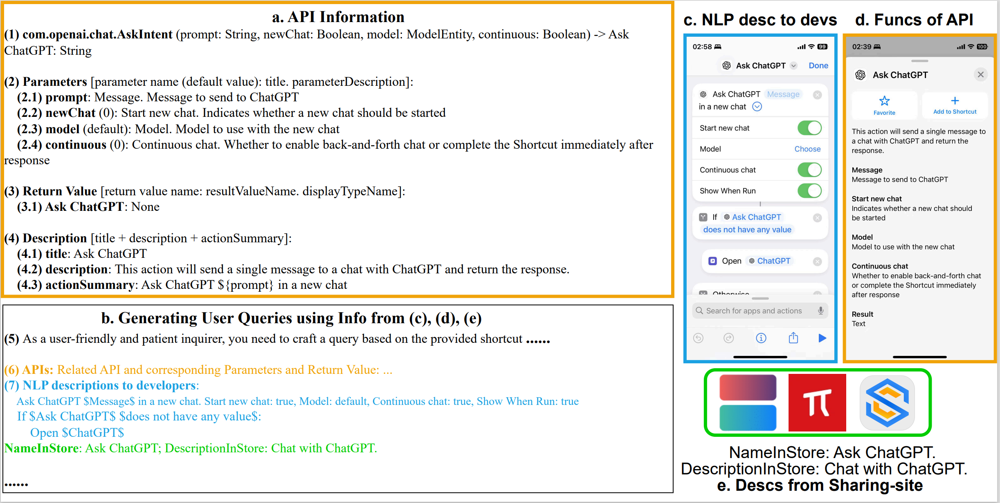

# ShortcutsBench Experiment

ShortcutsBench consists of three parts:
1. Shortcuts (i.e., the sequence of `golden` actions).
2. Queries (i.e., tasks assigned to agents).
3. APIs (i.e., tools that agents can use).

We categorize ShortcutsBench into five groups based on the length of the shortcuts (task difficulty). For the first four groups, we conducted comprehensive evaluations in three areas: API selection, parameter filling, and awareness of required information.

Below is a detailed introduction to our testing process:
- [Calculating Shortcut Length](#calculating-shortcut-length): Calculates the length of shortcuts to group ShortcutsBench.
- [Extracting API Information from API Source Files](#extracting-api-information-from-api-source-files): Extracts basic API information from three types of API description files: `.actionsdata`, `.intentdefinition`, and `WFActions.json`, such as `API name`, `API function description`, `user-friendly API function description`, `API parameter types`, `API parameter names`, `API parameter default values`, `API parameter descriptions`, `API return value types`, `API return value default names`, and `API return value descriptions`.

    The `user-friendly API function description` refers to the natural language description presented to developers for each action, as shown in `c. NLP desc to devs`, like `Ask ChatGPT $Message in a new chat`. This natural language description is specifically designed for users and is easy to understand.
    
    A general `API function description`, as described in `a.4.description`, is like `This action will send a single message to a chat with ChatGPT and return the response.` This natural language description typically describes the API function from a third-person perspective.
    
    

- [Constructing Shortcut Description Files](#constructing-shortcut-description-files): Constructs shortcut description files based on shortcut source files and `user-friendly API function descriptions` of the APIs involved. These description files are made up of a series of `user-friendly API function descriptions` arranged in the order of actions in the original shortcuts, with indentation corresponding to branches and loops. These description files help us generate high-quality queries using general models (such as `GPT-3.5-turbo`). To ensure quality, we still use one of the strongest models, `GPT-4`, to generate queries.
- [Generating Queries](#generating-queries): Based on the shortcut name, the functional description of the shortcut collected, the comments in the shortcut, the description file of the shortcut, and the basic information of the APIs involved, we ask `GPT-4` to generate high-quality queries:
    1. The query must describe a problem that the shortcut can complete.
    2. The query should include all necessary parameters from the shortcut.
    3. The query should be naturally and fluently organized, with the parameters integrated into the problem rather than listed separately.
- [Filtering Parameters in Queries](#filtering-parameters-in-queries): Further filters the queries generated in the previous step to extract the parameters we need to verify. We found that to ensure query fluency, LLM still ignores some parameters in the queries. Since we need to test the correctness of parameter filling, we further filtered the parameters based on the generated queries, API descriptions, and the shortcuts themselves to ensure that the parameters are explicitly or implicitly included in the query.
- [Classifying Shortcuts](#classifying-shortcuts): To explore the performance of language models on different types of tasks, we first summarized eight main types of shortcuts based on the type fields collected from the shortcut store. Then, based on the type fields, description files, and functional descriptions of the shortcuts collected from the shortcut store, we let the language model classify all shortcuts in a standardized manner.
- [Agent Capability Evaluation](#agent-capability-evaluation): Inputs the queries and sampled API descriptions to the agents to evaluate the performance of different agents.

## Calculating Shortcut Length

We first calculate the length of shortcuts to group ShortcutsBench.

Relevant code is shown in [`cal_shortcut_len.py`](./cal_shortcut_len.py), which accepts the `1_final_detailed_records_filter_apis.json` file and filters out shortcuts with a length not greater than `30`, storing them in a new file `1_final_detailed_records_filter_apis_leq_30.json`.

Run this code to generate the `1_final_detailed_records_filter_apis_leq_30.json` file, which can be obtained from [Google Drive](https://drive.google.com/file/d/1Xw8PI9FH_ud6_S5gR-xpneFDZsCoQHQM/view?usp=sharing) or [Baidu Cloud](https://pan.baidu.com/s/1NiKxy1KL9dNgIYq7aOZ8sA?pwd=sx6u), with the extraction password `shortcutsbench`.

## Extracting API Information from API Source Files

We then extract basic API information from three types of API description files: `.actionsdata`, `.intentdefinition`, and `WFActions.json`, such as `API name`, `API function description`, `user-friendly API function description`, `API parameter types`, `API parameter names`, `API parameter default values`, `API parameter descriptions`, `API return value types`, `API return value default names`, and `API return value descriptions`.

Relevant code:
1. [`WFActionsClass.py`](./WFActionsClass.py): Extracts basic API information from `WFActions.json`.
2. [`APIsClass.py`](./APIsClass.py): Extracts basic API information from `.actionsdata` and `.intentdefinition` files in `4_api_json_filter.json`. Information on obtaining `4_api_json_filter.json` can be found in the [README.md](../deves_dataset/dataset_src_valid_apis/README.md).

## Constructing Shortcut Description Files

We construct shortcut description files based on shortcut source files and the `user-friendly API function descriptions` of the APIs involved.

Relevant code is shown in [`generate_shortcut_desc.py`](./generate_shortcut_desc.py). This file generates four outputs:
1. [`all_api2info.json`](../data/all_api2info.json), a dictionary mapping APIs to API information.
2. [`all_api2paraname2paratype.json`](../data/all_api2paraname2paratype.json), a dictionary mapping APIs to parameter names and then to parameter types.
3. [`all_api2parasummary.json`](../data/all_api2parasummary.json), a dictionary mapping APIs to `user-friendly API function descriptions`.
4. [`all_shortcuts_paras_that_is_necessary_in_query.json`](../data/all_shortcuts_paras_that_is_necessary_in_query.json), parameters of primitive data types and enumerated data types in both API information and JSON format shortcut files. We further filtered these parameters to ensure they are explicitly or implicitly included in the queries. We used the final filtered parameters to evaluate parameter filling accuracy.
5. [`shortcut2desc.json`](../data/shortcut2desc.json), a mapping of shortcut iCloud URLs to shortcut description files.

## Generating Queries

We generate high-quality queries based on the shortcut name, the functional description of the shortcut collected, the comments in the shortcut, the description file of the shortcut, and the basic information of the APIs involved.

Relevant code is shown in [`generate_queries.py`](./generate_queries.py). This code generates `generated_success_queries.json` (there are also some failures due to the context length limitation of the language model, stored in `generated_fail_queries.json`).

The `generated_success_queries.json` file can be obtained from [Google Drive](https://drive.google.com/file/d/1XzGYIUE0vXTiERJm2yVLZ90knb4uchQ2/view?usp=sharing) or [Baidu Cloud](https://pan.baidu.com/s/1RIRmJyc5y1hhnyMZBsAqUQ?pwd=y0er).
The `generated_fail_queries.json` file can be obtained from [Google Drive](https://drive.google.com/file/d/1w9jeEdnMgHg9dcA6TZbYrLCElKIj2Agj/view?usp=sharing) or [Baidu Cloud](https://pan.baidu.com/s/1SdN_fRp6GcOiMC05YQxkRQ?pwd=j5ra).

**Friendly Reminder**: Please be mindful of costs when using GPT-4 series models. Generating queries may cost hundreds of dollars.

## Filtering Parameters in Queries

We found that to ensure the naturalness and fluency of the queries, the language model-generated queries do not always explicitly or implicitly integrate parameters into the query. To ensure our evaluation of parameter filling is accurate, we further used the language model to filter the generated queries to ensure accurate parameter evaluation.

Relevant code is shown in [`check_intersection_of_query_and_para_necessary.py`](./check_intersection_of_query_and_para_necessary.py). This code further filters the parameters appearing in the queries based on `generated_success_queries.json` and `all_shortcuts_paras_that_is_necessary_in_query.json`, which are used for the second experiment to evaluate parameter filling accuracy.

This code generates [`f"{model_name}_check_intersection_of_query_and_para_necessary.json"`](../data/gpt-3.5-turbo_check_intersection_of_query_and_para_necessary.json), which contains further filtered parameters.

## Classifying Shortcuts

To explore the performance of language models on different types of tasks, we first summarized eight main types of shortcuts based on the type fields collected from the shortcut store. Then, based on the type fields, description files, and functional descriptions of the shortcuts collected from the shortcut store, we let the language model classify all shortcuts in a standardized manner.

Relevant code is shown in `generate_categories.py`. This code uses shortcut description files, type fields, and functional descriptions to invoke the language model for further classification of shortcuts.

This code generates [`generated_success_categories.json`](../data/generated_success_categories.json) and [`generated_fail_categories.json`](../data/generated_fail_categories.json), representing successfully and unsuccessfully classified shortcuts, respectively. Classification failures are due to a small number of overly long shortcuts, which we ignored.

## Agent Capability Evaluation

We then proceed with the agent capability evaluation as described in the [ShortcutsBench paper](https://arxiv.org/pdf/2407.00132). The relevant code is shown in [`all_experiments.py`](./all_experiments.py).

This code generates the following files, representing the results:
- `experiment_res_deepseek-chat.jsonl`
- `experiment_res_deepseek-coder.jsonl`
- `experiment_res_gemini-1.5-flash.jsonl`
- `experiment_res_gemini-1.5-pro.jsonl`
- `experiment_res_GLM-4-Air.jsonl`
- `experiment_res_gpt-4o-mini.jsonl` (new added)
- `experiment_res_gpt-3.5-turbo.jsonl`
- `experiment_res_meta-llama_Llama-3-70b-chat-hf.jsonl`
- `experiment_res_qwen2-57b-a14b-instruct.jsonl`
- `experiment_res_qwen2-72b-instruct.jsonl`

These files can be downloaded from [Google Drive](https://drive.google.com/file/d/1jnJj5DhMy7Pat7TeVpA1USZWBmyjIWUo/view?usp=sharing) or [Baidu Cloud](https://pan.baidu.com/s/1zahYXa96dN6ZfPHlakAyIw?pwd=uwqh), with the extraction password `shortcutsbench`.

The newly added files can be downloaded from [Google Drive](https://drive.google.com/file/d/1lTHRgibCLclQm-XoMLLtPabHfPBMzOZs/view?usp=sharing) or [Baidu Cloud](https://pan.baidu.com/s/1RZdi24JEoGIcWSYbRWB2xA?pwd=up79), with `shortcutsbench` as the extraction password.

We then use [`all_experiments_res.py`](./all_experiments_res.py) for plotting and analysis.