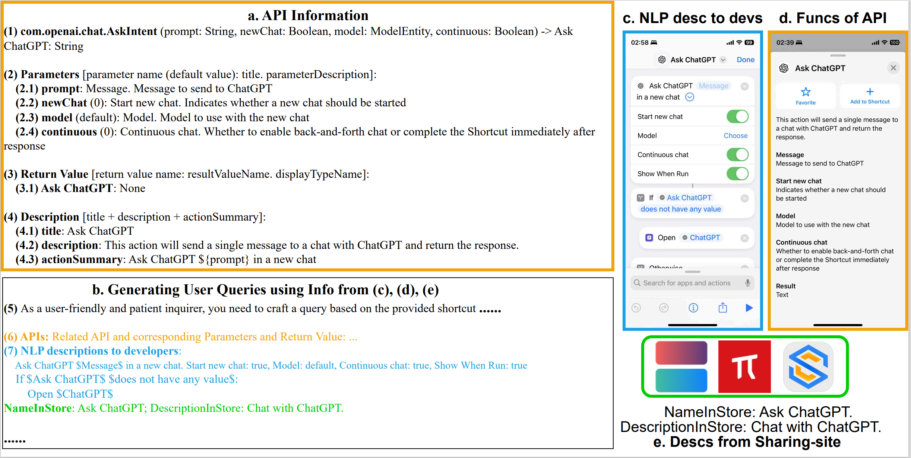

# ShortcutsBench实验

ShortcutsBench包括三个部分：
1. 快捷指令（即`golden`的动作序列）。
2. 查询（即安排给智能体的任务）。
3. APIs（即智能体可以使用的工具）。

我们将ShortcutsBench按照快捷指令的长度（任务的困难成都）分成五个组别，对前四个组别，在API选择、参数填充、和要求必要信息的意识三个方面，进行了全面系统的评测。

以下详细介绍我们的测试流程：
- [计算快捷指令的长度](#计算快捷指令的长度)：计算快捷指令的长度以对ShortcutsBench进行分组。
- [从API源文件中提取API信息](#从API源文件中提取API信息)：从`.actionsdata`、`.intentdefinition`、`WFActions.json`三种类型的API描述文件中各自提取API的基本信息，例如`API名称`、`API功能描述`、`用户友好的API功能描述`、`API参数类型`、`API参数名`、`API参数默认值`、`API参数描述`、`API返回值类型`、`API返回值默认名称`、`API返回值描述`。
    
    `用户友好的API功能描述`，指如下图`c. NLP desc to devs`的每个动作所展现给开发者的自然语言描述，如 `Ask ChatGPT $Message in a new chat`。该自然语言描述是专门面向用户设计，通俗易懂。
    
    一般的`API功能描述`，则如`a.4.description`所述，形如`This action will send a single message to a chat with ChatGPT and return the response.`。该自然语言描述一般从第三人称视角描述API的功能。
    
    

- 依据快捷指令源文件和APIs的`用户友好API功能描述`，构造快捷指令的描述文件，即如上图`b.7`所示的快捷指令的描述文件。该描述文件由一系列`用户友好的API功能描述`按照快捷指令中原本动作的顺序构成，如果遇到分支和循环，则对应的额进行缩进。此快捷指令的描述文件，可以帮助我们用一般的模型（如`GPT-3.5-turbo`）便可以生成高质量的查询。为了确保质量，我们依旧使用了当前最强的模型之一`GPT-4o`生成查询。
- 依据快捷指令的名称、快捷指令收集站对快捷指令的功能描述、快捷指令中的comments、快捷指令的描述文件、快捷指令涉及的API的基本信息，我们要求`GPT-4o`生成高质量的查询：
    1. 该查询描述的问题，“必须”可由快捷指令完成。
    2. 该查询中应该包含快捷指令中所有的必须参数。
    3. 该查询的语言组织应该自然流畅，包含的参数应该融合在问题中，而不应该单独列出。
- 进一步筛选上一步生成的查询，提取出我们需要验证的参数。我们发现，为了生成问题的流畅性，LLM仍然会在查询中忽略一些参数，由于我们需要测试参数填充的正确性测试，我们进一步进行了参数筛选，即依据生成的查询、API描述、以及快捷指令本身进一步筛选我们需要测试的参数，确保该参数在query中显性或隐性的出现。
- 将查询和抽样得到的API描述输入给智能体，评测不同智能体的性能。

## 计算快捷指令的长度

我们首先计算快捷指令的长度以对ShortcutsBench进行分组。

相关代码如[`cal_shortcut_len.py`](./cal_shortcut_len.py)所示，该代码接受`1_final_detailed_records_filter_apis.json`文件，按照快捷指令的长度过滤出长度不大于`30`的快捷指令，存放在新文件`1_final_detailed_records_filter_apis_leq_30.json`中。

运行该代码以生成`1_final_detailed_records_filter_apis_leq_30.json`文件，该文件可从[Google云盘](https://drive.google.com/file/d/1Xw8PI9FH_ud6_S5gR-xpneFDZsCoQHQM/view?usp=sharing)或[百度网盘](https://pan.baidu.com/s/1NiKxy1KL9dNgIYq7aOZ8sA?pwd=sx6u)获取，解压密码为`shortcutsbench`。

## 从API源文件中提取API信息

随后我们从`.actionsdata`、`.intentdefinition`、`WFActions.json`三种类型的API描述文件中各自提取API的基本信息，例如`API名称`、`API功能描述`、`用户友好的API功能描述`、`API参数类型`、`API参数名`、`API参数默认值`、`API参数描述`、`API返回值类型`、`API返回值默认名称`、`API返回值描述`。

相关代码：
1. `WFActionsClass.py`：从`WFActions.json`中提取API的基本信息。
2. TODO