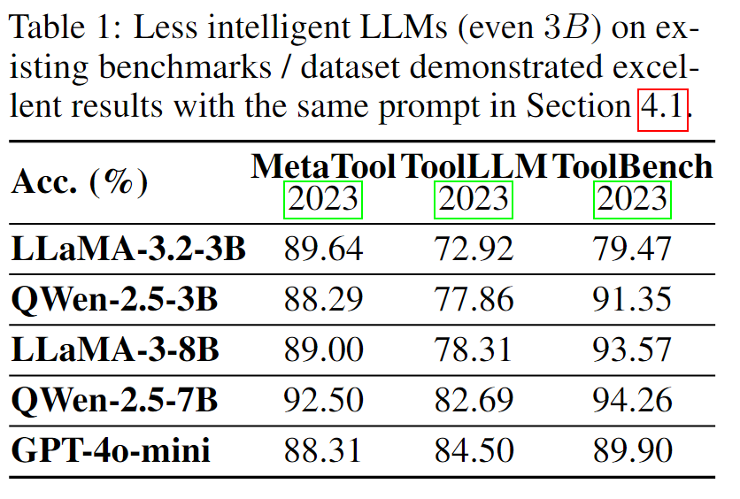

# all_experiments.py & all_experiments_res.py

## Result Analysis

This folder contains all the code documents for preliminary experiments, with all generated data stored in the `pre_data` folder under the project directory.

We conducted API selection experiments on several typical datasets. MetaTool uses the native GPT API, while ToolBench and ToolLLM have the longest average action lengths and the largest scale of real-world APIs, respectively.

The experimental results on these typical datasets are shown in the following figure:  


First, let's look at the results of $GPT-4o-mini$, a relatively less intelligent cloud-based large language model, on the existing datasets and the action sequence length $<=1$ from $ShortcutsBench$.

We can observe that $GPT-4o-mini$, despite being a relatively less intelligent cloud-based large language model, achieves a high API selection accuracy (around $80\% ~ 90\%$) on these datasets. Even the $3B$ model performs quite well on the current datasets, indicating that for benchmarks/datasets with shorter action sequences, the evaluation lacks the capability to differentiate more intelligent large language models. It even struggles to distinguish between the $3B$ and $7B$ models.

On the other hand, $ShortcutsBench$, when dealing with tasks involving long action sequences, can effectively differentiate between more intelligent large language models with larger parameters (e.g., $Gemini-1.5-Pro$) and relatively smaller, less intelligent models (e.g., $GPT-4o-mini$).

## Running Guide

For the open-source $LLaMA$ and $QWen$ model series, we deployed the models ourselves using $OLLaMA$. For $GPT-4o-mini$, we tested by calling the API.

Before using $OLLaMA$, please configure the environment variables as follows:

```shell
export SHORTCUTSBENCH_METATOOL_OTHER_DATA=$HOME/Source/ShortcutsBench/pre_data/metatool/
export SHORTCUTSBENCH_TOOLBENCH_OTHER_DATA=$HOME/Source/ShortcutsBench/pre_data/toolbench/
export SHORTCUTSBENCH_TOOLLLM_OTHER_DATA=$HOME/Source/ShortcutsBench/pre_data/toolllm/

export OLLAMA_BASE_URL=http://{your_ip_address}:{your_port}/v1
export OLLAMA_API_KEY='ollama'
```

You also need to prepare the corresponding files in the dataset folders, following the format of `../pre_data/pre_all_api2info.json` and `../pre_data/pre_generated_success_queries.json`.

Then, slightly modify and run the script like `restart_all_experiments_gpt_4o_mini.sh`:

```shell
./restart_all_experiments_gpt_4o_mini.sh --dataset_name metatool
```