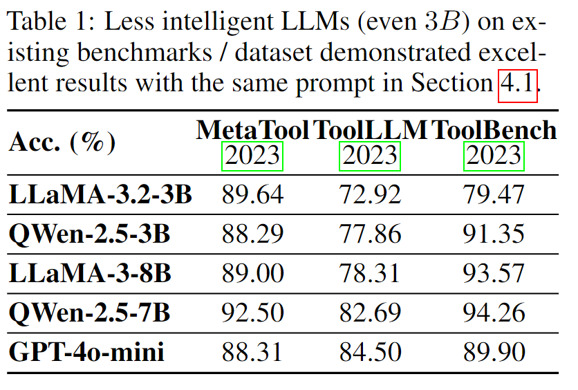

# all_experiments.py & all_experiments_res.py

## 结果分析

本文件夹存放预实验的所有代码文档，生成的所有数据存放在项目目录的`pre_data`文件夹下。

我们在几个典型数据集上进行了下一个API选择的实验，MetaTool使用原生的 GPT API，而 ToolBench 和 ToolLLM 分别具有最长的平均操作长度和最大的真实世界 API 规模。

在这几个典型数据集上的实验结果如下图所示：


首先我们来看$GPT-4o-mini$这种相对不太智能的云端大语言模型在当前已有的数据集和$ShortcutsBench$的动作序列长度$<=1$的结果。

我们可以发现，$GPT-4o-mini$这种相对不太智能的云端大语言模型，可以在这些数据集上都取得较高的（$80\% ~ $90\%$）类似的API选择精度，而即使是$3B$的模型，在当前已有的数据集上也可以取得相当不错的API选择效果。这说明，对于动作序列不太长的当前的benchmark/dataset来说，其评测具有更高智能的大语言模型的能力严重缺失，其甚至难以区分$3B$和$7B$模型的能力。

而$ShortcutsBench$在具有长动作序列的问题上，可以很好的区分具有更大规模参数更高智能程度的大语言模型（例如$Gemini-1.5-Pro$）以及相相对较低规模参数和智能的大语言模型（例如$GPT-4o-mini$）。

## 运行指南

对于开源的$LLaMA$和$QWen$系列模型，我们自行使用$OLLaMA$部署了模型，对于$GPT-4o-mini$，我们调用了API进行测试。

使用$OLLaMA$前，请先自行配置环境变量:

```shell
export SHORTCUTSBENCH_METATOOL_OTHER_DATA=$HOME/Source/ShortcutsBench/pre_data/metatool/
export SHORTCUTSBENCH_TOOLBENCH_OTHER_DATA=$HOME/Source/ShortcutsBench/pre_data/toolbench/
export SHORTCUTSBENCH_TOOLLLM_OTHER_DATA=$HOME/Source/ShortcutsBench/pre_data/toolllm/

export OLLAMA_BASE_URL=http://{your_ip_address}:{your_port}/v1
export OLLAMA_API_KEY='ollama'
```

您还需在对应的数据集文件夹准备好对应的文件，格式如`../pre_data/pre_all_api2info.json`和`../pre_data/pre_generated_success_queries.json`所示。

然后略微修改如`restart_all_experiments_gpt_4o_mini.sh`的脚本运行程序：
```shell
./restart_all_experiments_gpt_4o_mini.sh --dataset_name metatool
```